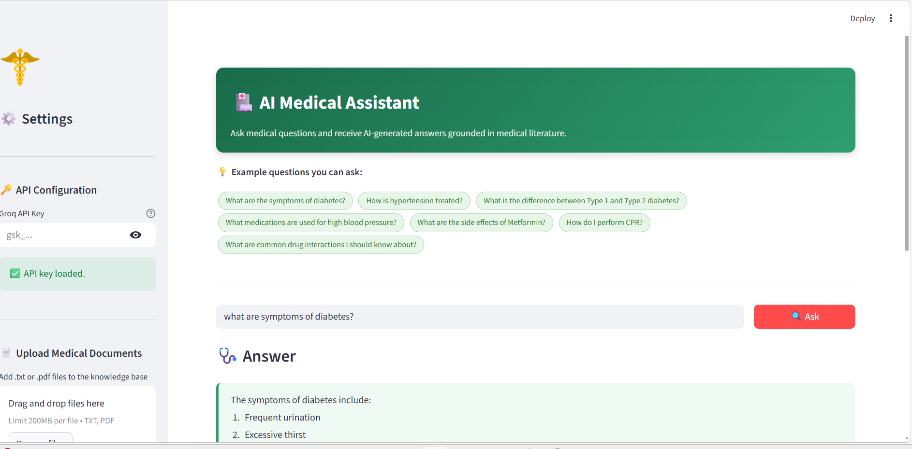
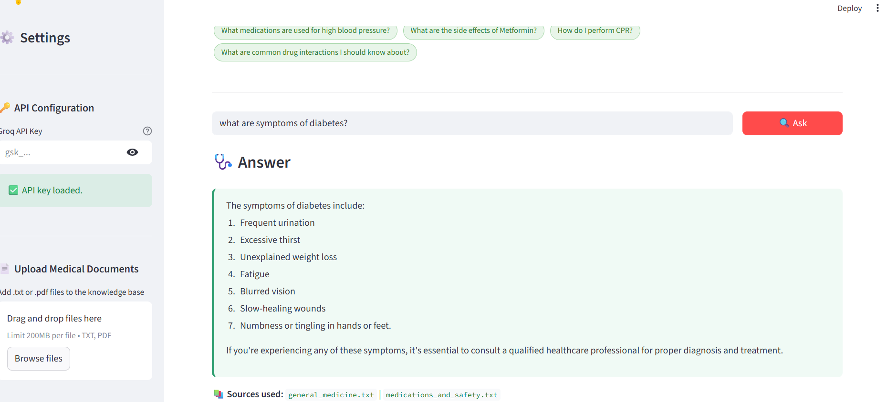
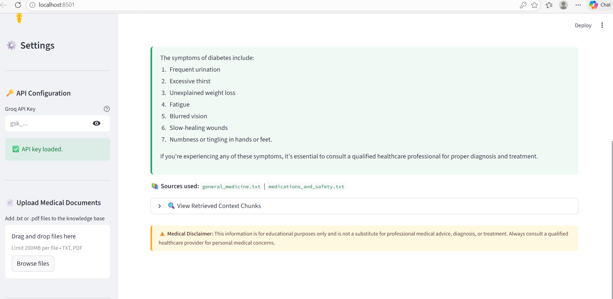

# AI Medical Assistant – RAG Healthcare Chatbot

AI Medical Assistant is an intelligent healthcare question-answering system built using **Retrieval-Augmented Generation (RAG)**.  
The application retrieves relevant information from medical documents and generates accurate responses using an AI model.

This project demonstrates how modern AI systems can combine **information retrieval and language models** to provide reliable, context-based answers.

⚠️ **Disclaimer:** This project is created for educational and research purposes only and should not be considered as professional medical advice.

---

## Project Demo







---

## Key Features

- Ask medical-related questions through a simple interface
- Upload medical documents (PDF or TXT)
- AI generates answers using document-based knowledge
- Retrieval-Augmented Generation (RAG) pipeline
- Context-aware responses to reduce hallucination
- Source-grounded answers for improved reliability
- Interactive web interface built with Streamlit

---

## System Workflow

1. User enters a medical question
2. The question is converted into vector embeddings
3. FAISS vector database retrieves relevant document sections
4. Retrieved context is passed to the language model
5. The model generates an informed response based on the retrieved knowledge

This architecture improves answer accuracy by ensuring responses are grounded in trusted documents.

---

## Technology Stack

- Python
- Streamlit
- LangChain
- FAISS Vector Database
- HuggingFace Embeddings
- Claude API

---

## Project Structure

```
AI-Medical-Assistant-RAG
│
├── app.py
├── rag_engine.py
├── data_loader.py
├── main.py
├── requirements.txt
│
├── medical_docs/
└── faiss_index/
```

---

## Installation & Setup

### Clone the repository

```
git clone https://github.com/Mithanya/AI-Medical-Assistant-RAG.git
cd AI-Medical-Assistant-RAG
```

### Install dependencies

```
pip install -r requirements.txt
```

### Run the application

```
streamlit run app.py
```

### Open in browser

```
http://localhost:8501
```

---

## Example Questions

- What are the symptoms of diabetes?
- How is hypertension treated?
- What are the side effects of Metformin?
- How do I perform CPR?

---

## Learning Outcomes

This project helped demonstrate:

- Retrieval-Augmented Generation (RAG)
- Vector databases using FAISS
- Building AI applications with Python
- Integrating AI models with real-world document retrieval
- Creating interactive applications using Streamlit

---

## Author

**Mithanya Murugesan**  
Engineering Student | Python Developer | AI Enthusiast

If you found this project useful, consider giving it a ⭐ on GitHub.
